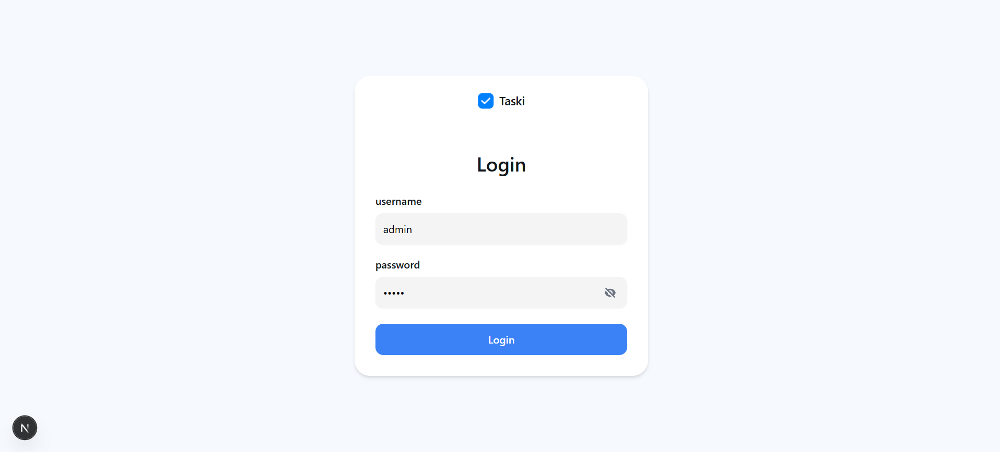
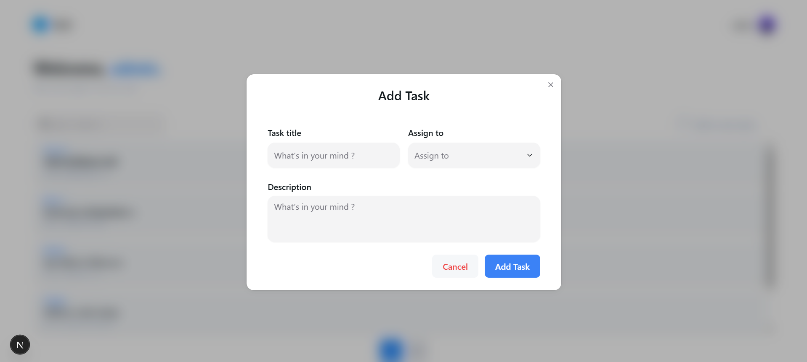

# Task-Management

Our **task manager**, built with React and Next.js, lets Admins manage all tasks and assign them to users, while Regular users can view and update only their own. It includes login, task status updates

## Tech Stack in

**Client:** Next.js, React, TailwindCSS


## Quick start

Clone the project

```bash
  git clone https://github.com/AbdelhaqNouhi/Taski.git
```

Run the project

```bash
  npm install
```

```bash
  npm run dev
```


## Endpoints

| Method    | Endpoint     | Description                |
| :-------- | :------- | :------------------------- |
| `POST` | `https://recruter-backend.vercel.app/api/login` | **Login**|
| `GET` | `https://recruter-backend.vercel.app/api/tasks/` | **See Tasks**|
| `POST` | `https://recruter-backend.vercel.app/api/tasks` | **Create Task**|
| `PUT` | `https://recruter-backend.vercel.app/api/tasks/id` | **Update Task**|
| `DELETE` | `https://recruter-backend.vercel.app/api/tasks/id` | **Delete Task**|
| `GET` | `https://recruter-backend.vercel.app/api/users` | **See all users**|
| `GET` | `https://recruter-backend.vercel.app/api/users/id` | **See user**|


**OverView**






## Authors

- [@Abdelhaq Nouhi]